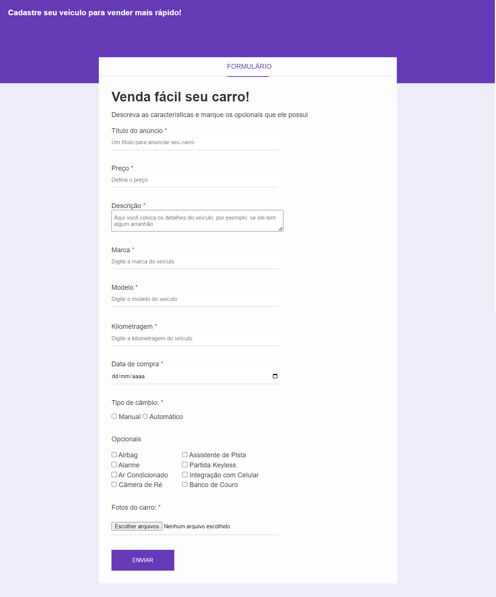

# 🚗 Formulário de Venda de Carros Online

Este é um projeto de formulário online para venda de carros, desenvolvido com HTML e CSS.  
O objetivo é criar uma interface simples e intuitiva para que os usuários possam listar seus veículos à venda, bastante similar ao Google Forms.

## ✨ Funcionalidades

- **Detalhes do Carro**:
  
  - Título do Anúncio
  - Marca e modelo
  - Ano de fabricação
  - Preço
  - Menus Opcionais
  - Descrição detalhada
- **Simulação de Upload de Fotos**: Permite anexar imagens do carro.

## 🛠️ Tecnologias Utilizadas

- **HTML**: Para estruturar o conteúdo.
- **CSS** : Para estilizar e melhorar a apresentação visual.
- 
## 💻 Tela

---

  by: Fernanda Tozzi💜
   
  <a href="www.linkedin.com/in/fernandatozzihonorio">Linkedin</a>

